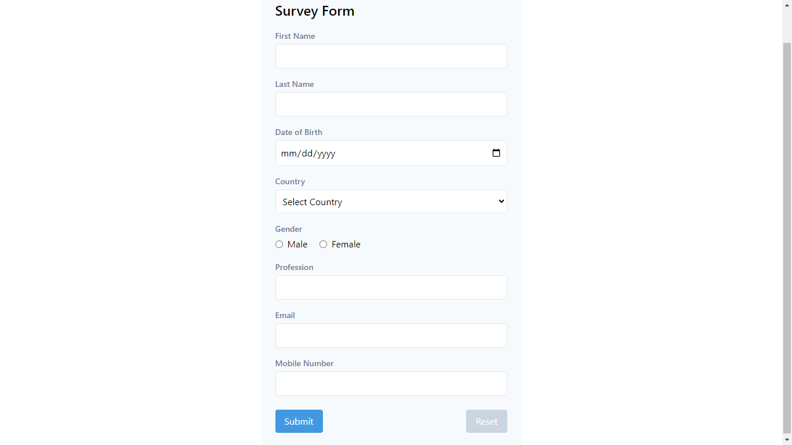
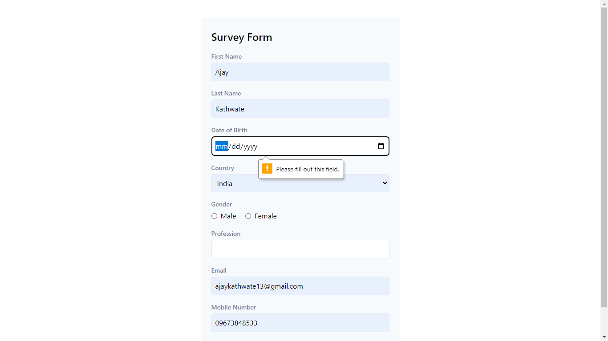
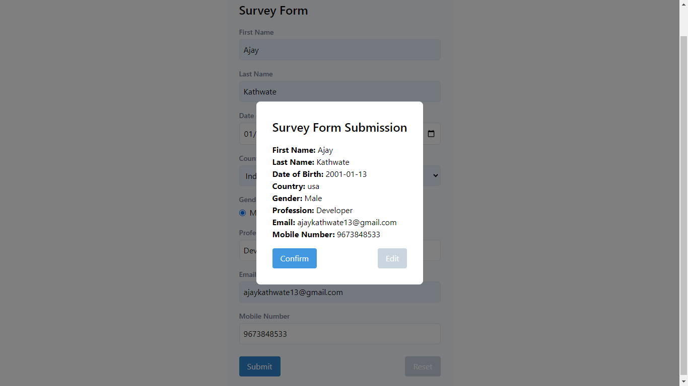
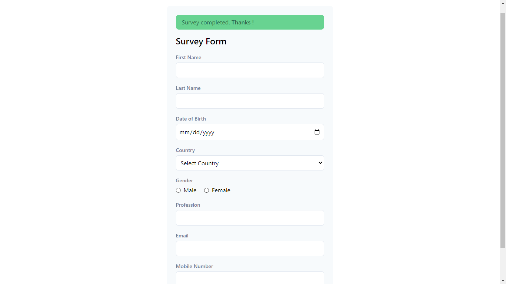

# Screenshots
## 1. main form with validations

## 2. model with confirm to submit the form and option to edit the info filled as well.

## 3. After form submit it shows the success message for 5 seconds and reset all the fields
